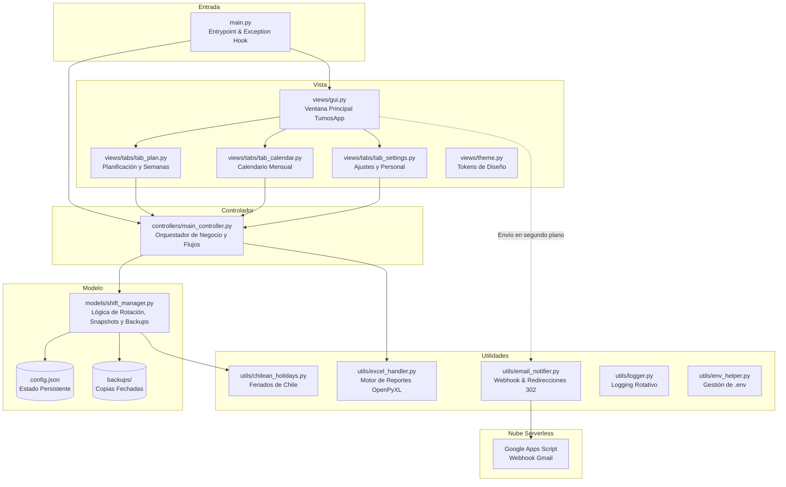
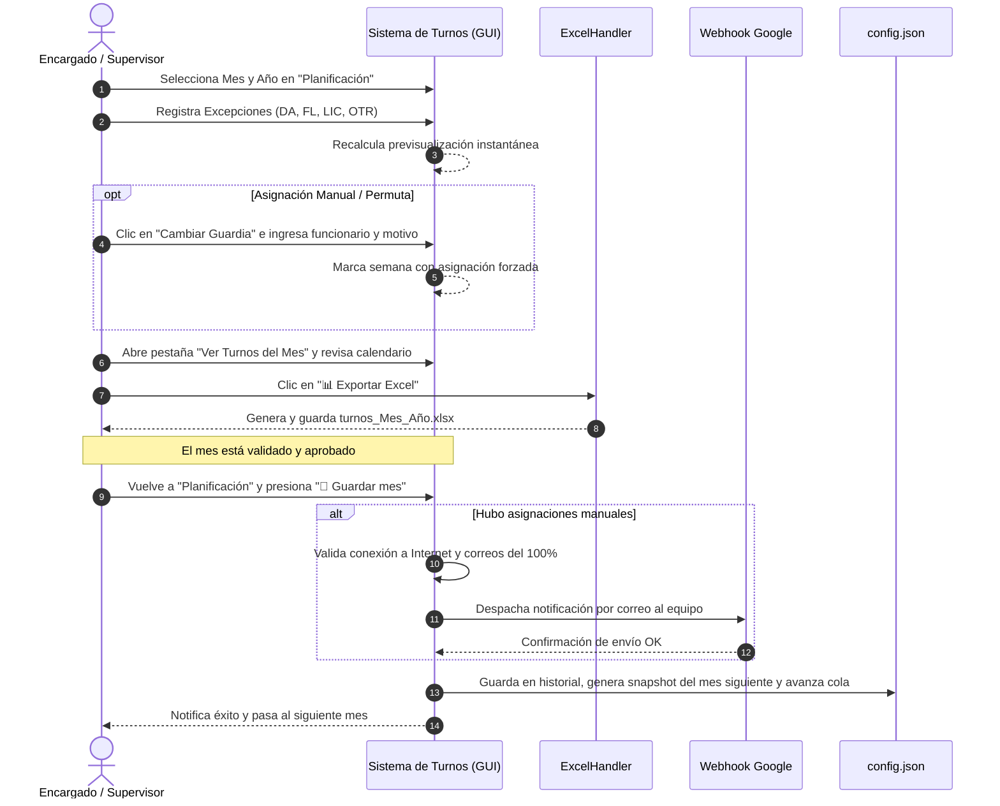

# 🗓️ Sistema de Gestión de Turnos de Guardia

<div align="center">


-16877D)
-217346?logo=microsoftexcel&logoColor=white)
-EA4335?logo=google&logoColor=white)


**Aplicación de escritorio moderna, robusta y automatizada para la planificación, asignación rotativa semanal, gestión de excepciones y notificación institucional de turnos de guardia.**

[Características](#-características-principales) •
[Manual de usuario](#-manual-de-usuario) •
[Arquitectura](#-arquitectura-del-sistema) •
[Instalación y Uso](#-instalación-y-uso-rápido) •
[Notificaciones Serverless](#-notificaciones-por-correo-google-apps-script) •
[Flujo Operativo](#-flujo-de-trabajo-operativo-recomendado) •
[Documentación](#-documentación-oficial-del-proyecto)

</div>

---

## 📌 Descripción General

El **Sistema de Gestión de Turnos** es una solución informática de escritorio diseñada específicamente para resolver la complejidad operativa en la distribución de turnos de guardia semanales en equipos de funcionarios o personal técnico/operativo (diseñado para dotaciones de 16 personas o escalable a cualquier número).

Tradicionalmente, la confección manual de calendarios en planillas de cálculo dispersas genera errores humanos frecuentes: funcionarios que repiten guardias consecutivas tras recuperar permisos, asignación injusta en feriados patrios o festivos de fin de año, pérdida del historial de rotación al cerrar meses fuera de orden, y falta de comunicación oportuna cuando se aprueban cambios o permutas de última hora.

Este sistema soluciona dichos problemas combinando un **motor algorítmico determinista con reglas de equidad**, una **interfaz gráfica moderna en modo oscuro**, **exportación de informes oficiales en Excel** y un **mecanismo serverless de notificación por correo electrónico** sin costo operativo.

---

## ✨ Características Principales

### 🧱 Límites internos de arquitectura

El modelo conserva una fachada compatible (`ShiftManager`), pero sus
responsabilidades principales están separadas:

- `models/config_repository.py`: lectura, validación y escritura atómica de la configuración.
- `models/rotation_engine.py`: límite del motor de generación de turnos.
- `models/domain_types.py`: tipos explícitos para asignaciones y excepciones.

La GUI y el controlador siguen consumiendo el formato histórico de diccionarios
para mantener compatibilidad con configuraciones y reportes existentes.

### 🔄 1. Motor de Rotación Algorítmica Inteligente
- **Cola Circular Continua:** Asigna las semanas de guardia siguiendo estrictamente el orden del personal (`siguiente_id`), garantizando que todos cumplan su cuota proporcional de servicio.
- **Cola de Recuperación de Pendientes (`pendientes`):** Si un funcionario no puede cumplir su turno programado por encontrarse con permiso o licencia médica, se salta automáticamente y se registra en la lista de pendientes para recuperar su turno apenas se encuentre disponible.
- **Regla de Enfriamiento y Espaciado (`min_gap_weeks = 4`):** El algoritmo impide que un funcionario reciba dos turnos en un intervalo menor a 4 semanas (incluso al recuperar turnos pendientes o tras asignaciones forzadas), evitando sobrecargas laborales y fatiga.
- **Regla Anual de Feriados Chilenos (`holidays.countries.chile`):** Consulta el historial del año anterior para evitar que una persona repita la guardia en el mismo feriado nacional (Fiestas Patrias, Navidad, Año Nuevo, etc.) en años consecutivos. Compara los feriados por nombre normalizado, adaptándose a feriados móviles.
- **Asignaciones Manuales con Motivo Obligatorio:** Permite forzar o permutar la guardia de cualquier semana directamente desde la interfaz, exigiendo un motivo justificativo registrado para auditoría y aviso al equipo.

### 🖥️ 2. Interfaz Gráfica Ergonómica (CustomTkinter Dark Mode)
- **Diseño Ergonómico Moderno:** Paleta de colores de alto contraste inspirada en suites profesionales (`#111418`, `#1C2228`, `#57C7B5`).
- **Pestaña 📋 Planificación:**
  - Selector ágil de mes y año con previsualización en tiempo real.
  - Indicador dinámico que calcula y muestra la fecha del próximo turno proyectado para el funcionario seleccionado.
  - Ingreso flexible de excepciones por rangos o listas (ej: `1-5, 12, 20-25`).
  - Tarjetas semanales interactivas con detalle de fechas, funcionario asignado, estado (automático, forzado o manual) y diálogo modal para reasignaciones.
  - Detección de cambios sin guardar mediante indicador visual en el título (`● Sistema de Turnos`) y confirmación de seguridad al salir.
- **Pestaña 📅 Ver Turnos del Mes:**
  - Vista de calendario mensual en cuadrícula con celdas coloreadas según el estado de cada día (Turno, DA, FL, LIC, OTR, Fin de semana y Día actual).
  - Navegación temporal instantánea (mes anterior, mes siguiente, botón "Hoy").
  - Botón directo para exportar el reporte oficial en Excel (`📊 Exportar Excel`).
- **Pestaña ⚙️ Ajustes:**
  - Configuración y ajuste manual del funcionario de inicio de la rotación.
  - **Gestión completa de personal (CRUD):** Agregar funcionario con correo, editar datos, eliminar preservando el historial y reordenar la rotación mediante botones `⬆` y `⬇`.
  - Panel de control del Webhook de correo con botón interactivo de prueba de envío.
  - Herramientas de mantenimiento y reinicio controlado de historial.

### 📊 3. Generación Oficial de Reportes Excel (.xlsx)
- Construido mediante `openpyxl` directamente en memoria, sin requerir plantillas externas.
- **Matriz Mensual de 31 Días:** Cuadrícula completa con nombres de funcionarios, días numéricos y letras de días de la semana (`L, M, X, J, V, S, D`).
- **Identificación Visual:** Días de guardia regular en rojo institucional (`#FF3B30`), cambios manuales / permutas en verde esmeralda (`#059669`), fines de semana en gris tenue (`#D9D9D9`) y días inválidos bloqueados (ej: 29-31 en febrero o 31 en meses de 30 días).
- **Trazabilidad de Permutas en Excel:** Cada celda de cambio manual incluye una nota interactiva (`Comment`) indicando el funcionario asignado, el funcionario original y el motivo justificado. Al pie del reporte se genera automáticamente la tabla `"REGISTRO DE CAMBIOS MANUALES DE GUARDIA (PERMUTAS / ACCIDENTES)"`.
- **Detalle de Excepciones OTR:** Genera la tabla formal `"DETALLE DE PERMISOS Y EXCEPCIONES ESPECIALES (OTR)"` con funcionario, rangos de fechas agrupados y motivo obligatorio.
- **Columnas de Totales Acumulados:** Métricas por funcionario al costado derecho: cantidad total de `TURNOS`, `DA`, `FL`, `LIC` y `OTR`.
- **Bloque de Convenciones y Leyenda:** Muestras de color y descripciones formales al pie de la tabla (incluyendo Turno Regular, DA, FL, LIC, OTR, Fin de Semana y Cambio Guardia Manual).
- **Configuración de Impresión:** Orientación horizontal (Landscape Carta) autoajustada exactamente a 1 página de ancho (`fitToWidth = 1`).
- **Respeto Histórico:** Incluye en el reporte a funcionarios que hayan tenido turnos o excepciones en ese periodo, aunque hayan sido dados de baja del personal activo posteriormente.

### 📧 4. Notificaciones Serverless por Correo Electrónico
- **Cero Costo y Máxima Privacidad:** Implementado mediante Google Apps Script (`scripts/google_apps_script.js`), utilizando la infraestructura de Gmail sin almacenar credenciales en la máquina local.
- **Envío Automatizado:** Al guardar un mes que contenga asignaciones manuales o permutas, el sistema despacha una notificación por correo a todo el equipo.
- **Pre-validaciones de Seguridad:**
  1. Comprueba conexión activa a Internet antes de proceder.
  2. Verifica que el 100% de los funcionarios activos tengan un correo válido registrado.
  3. Ejecuta el envío en un hilo en segundo plano (`threading.Thread`) para evitar bloqueos en la interfaz.
- **Formato Claro y Estructurado:** Detalla la semana modificada, el funcionario que estaba originalmente programado, el nuevo funcionario asignado, el motivo del cambio y la marca temporal de registro.

### 🛡️ 5. Resiliencia de Datos y Tolerancia a Fallos
- **Escritura Atómica de Configuración:** Las modificaciones a `config.json` se escriben primero en un archivo temporal (`config.json.tmp`), se sincronizan a disco con `os.fsync()` y se reemplazan atómicamente con `os.replace()`, evitando la corrupción de datos ante cortes eléctricos o cierres forzados.
- **Respaldos Automáticos Fechados:** Antes de cada avance de mes o cambio crítico, se genera una copia de seguridad en la carpeta `backups/` (`config_YYYYMMDD_HHMMSS_pre_advance.json`). Mantiene automáticamente los últimos 20 respaldos.
- **Recuperación ante Archivos Corruptos:** Si `config.json` se daña por causas externas, el sistema lo aísla en `backups/*.corrupted_<timestamp>` e inicializa un estado seguro sin interrumpir la ejecución.
- **Registro Centralizado de Eventos (`turnos.log`):** Logger con rotación de archivos para diagnóstico y trazabilidad de operaciones.

---

## 🏛️ Arquitectura del Sistema

El proyecto sigue una arquitectura **MVC (Modelo - Vista - Controlador)** desacoplada y modular:



### Componentes y Responsabilidades

| Módulo / Archivo | Responsabilidad |
|---|---|
| `main.py` | Punto de entrada. Detecta si corre como binario `.exe` o script `.py`, carga variables `.env`, configura el capturador global de errores (`sys.excepthook`) y lanza la GUI. |
| `controllers/main_controller.py` | Media entre la vista y el modelo. Resuelve cadenas temporales de meses futuros, prepara listas de personal activo e histórico para exportación y valida reglas de negocio. |
| `models/shift_manager.py` | Núcleo del sistema: algoritmo de rotación circular, cola de pendientes, reglas de feriados chilenos, cálculo de gap mínimo (4 semanas), snapshots mensuales y guardado atómico. |
| `views/gui.py` | Coordinador principal de la ventana CustomTkinter. Gestiona hilos en segundo plano, control de cambios sucios (indicador ●) y orquesta el cierre de mes con notificaciones. |
| `views/tabs/tab_plan.py` | Vista de planificación: selector de periodo, formulario de excepciones, tarjetas interactivas semanales y botón "Guardar mes". |
| `views/tabs/tab_calendar.py` | Vista visual de calendario en cuadrícula con chips de color y botón para exportar a Excel. |
| `views/tabs/tab_settings.py` | Panel de ajustes: punto de inicio, CRUD de personal con reordenamiento, configuración del Webhook de correos y prueba interactiva. |
| `utils/excel_handler.py` | Generador de plantillas y planillas Excel (.xlsx) con estilos, fórmulas de resumen, leyendas y formato de impresión. |
| `utils/email_notifier.py` | Validador de conexión a Internet, formateador de mensajes y cliente HTTP POST compatible con redirecciones 302 de Google Apps Script. |
| `utils/chilean_holidays.py` | Interfaz con la librería `holidays` para Chile y normalización de nombres de días festivos. |
| `utils/logger.py` | Sistema de logging rotativo que escribe en consola y en `turnos.log`. |
| `scripts/google_apps_script.js` | Código fuente listo para desplegar en Google Apps Script para actuar como webhook receptor y emisor de correos vía Gmail. |

---

## 🏷️ Convenciones de Excepciones y Personal

### Tipos de Excepción Admitidos

| Sigla | Nombre | Color Visual | Descripción |
|:---:|---|:---:|---|
| **`DA`** | Día Administrativo | Naranja (`#B45309`) | Permiso administrativo legalmente concedido. |
| **`FL`** | Feriado Legal | Violeta (`#5B21B6`) | Periodo de vacaciones o descanso reglamentario. |
| **`LIC`** | Licencia Médica | Turquesa (`#0E7490`) | Reposo por prescripción de salud. |
| **`OTR`** | Otro Permiso | Gris Azulado (`#374151`) | Comisión de servicio, duelo, capacitación, etc. |
| **`FOR`** | Asignación Forzada | Verde Esmeralda (`#059669`) | Reemplazo o asignación manual directa en la semana. |

### Convenciones de Nombres del Personal
Los nombres de los funcionarios se registran bajo el formato estandarizado:
```
[RANGO] [(SUFIJO)] [APELLIDO1] [APELLIDO2] [NOMBRES]
```
Prefijos reconocidos y omitidos automáticamente en tarjetas reducidas y avatares:
- `COM`: Comisario
- `SBC`: Subcomisario
- `PRO`: Profesional
- `(A)`: Administrativo
- `(F)`: Femenino

---

## 🚀 Distribución y Uso Rápido

### Modo 1: Ejecutable Autónomo Standalone (`Sistema de Turnos.exe`) — Recomendado para Funcionarios

Diseñado específicamente para computadores de funcionarios y estaciones de trabajo institucionales en **Windows 10** y **Windows 11**. **No requiere permisos de administrador ni asistente de instalación**.

1. **Sin Instalación ni Privilegios de Administrador:** Los funcionarios no necesitan solicitar claves de administrador a los departamentos de soporte/TI ni lidiar con bloqueos de políticas de seguridad (UAC).
2. **Uso Inmediato:** Descarga o copia directamente `dist/Sistema de Turnos.exe` a tu Escritorio, carpeta personal o a un pendrive USB, y haz doble clic para iniciar.
3. **Persistencia Segura en el Perfil de Usuario:**
   Tus archivos de datos (`config.json`), respaldos automáticos (`backups/`), auditoría y logs se gestionan automáticamente en la carpeta protegida de tu usuario:
   ```text
   %APPDATA%\Sistema de Turnos\
   ```
   *Nota:* También soporta **Modo Portable**: si colocas un archivo `config.json` o `.portable` en la misma carpeta del `.exe`, los datos se guardarán localmente junto al ejecutable (ideal para llevar en un pendrive).
4. **Actualizaciones sin Pérdida de Datos:**
   Para actualizar a una versión nueva, simplemente reemplaza el archivo `Sistema de Turnos.exe` por el nuevo ejecutable. **Tus turnos históricos, configuraciones, excepciones y respaldos se conservan al 100% de manera automática**.
5. **Eliminación Limpia:** Si deseas retirar la aplicación, basta con borrar el archivo `Sistema de Turnos.exe` sin dejar entradas en el registro ni requerir desinstaladores.

---

### Modo 2: Desarrollador (Ejecución desde Código Fuente)

#### Requisitos Previos:
- Python 3.10 o superior instalado en el sistema.
- PowerShell o terminal de comandos en Windows.

#### Paso a paso:

1. **Clonar el repositorio:**
   ```powershell
   git clone https://github.com/MartinLopez1011/Sistema-de-turnos.git
   cd "Sistema de turnos"
   ```

2. **Crear y activar el entorno virtual:**
   ```powershell
   py -m venv .venv
   .\.venv\Scripts\Activate.ps1
   ```

3. **Instalar dependencias del proyecto:**
   ```powershell
   pip install -r requirements.txt
   ```

4. **Configurar variables de entorno (opcional):**
   ```powershell
   Copy-Item .env.example .env
   ```

5. **Iniciar la aplicación:**
   ```powershell
   python main.py
   ```

---

## 📖 Manual de Usuario

Esta sección describe el flujo recomendado para supervisores y encargados de
planificación. La aplicación conserva el historial cerrado y separa claramente
la **previsualización**, la **exportación** y el **cierre definitivo del mes**.

### 1. Iniciar la planificación

1. Abre la aplicación.
2. En la pestaña **📋 Planificación**, selecciona el **mes** y **año**.
3. Revisa las tarjetas semanales generadas automáticamente.
4. Al seleccionar cualquier funcionario en el panel, el sistema calcula y muestra la
   **fecha estimada de su próximo turno proyectado**.
5. El sistema utiliza la rotación continua, la cola de pendientes, la **regla de descanso
   mínimo de 4 semanas** (`min_gap_weeks = 4`), la protección anual de feriados chilenos
   y el historial para mantener absoluta equidad y continuidad.

La previsualización no modifica el historial ni la cola de rotación.

### 2. Registrar excepciones

Cuando un funcionario no pueda cubrir determinados días:

1. Selecciona la persona en el panel lateral.
2. Escribe los días del mes. Se aceptan días individuales y rangos, por ejemplo:
   `1-5, 12, 19-20`.
3. Selecciona el tipo:
   - **DA**: Día Administrativo.
   - **FL**: Feriado Legal.
   - **LIC**: Licencia Médica.
   - **OTR**: Otro permiso o impedimento (exige ingresar obligatoriamente un **motivo o justificación**, el cual se visualiza en la lista y se exporta como nota/comentario en la celda de Excel).
4. Presiona **＋ Añadir**.
5. Comprueba en la lista de excepciones que los días, el tipo y el motivo sean correctos.

El sistema recalcula la vista previa y registra como pendiente a quien haya sido
saltado por una excepción, para que recupere su turno cuando corresponda y cumpla su descanso.
Cualquier cambio sin guardar se reflejará con el indicador **●** en el título de la ventana.

### 3. Gestionar una permuta o asignación manual

Para cambiar una semana específica:

1. En la tarjeta de la semana, presiona el botón **✏️ Cambiar**.
2. Elige el funcionario que cubrirá efectivamente el turno.
3. Ingresa el **motivo obligatorio** de la modificación (para auditoría y aviso al equipo).
4. Confirma la asignación.
5. La tarjeta se identificará con la etiqueta verde **📌 MANUAL**. Si deseas revertir
   el cambio al cálculo automático de la cola, presiona el botón **↺ Auto**.

Las asignaciones manuales quedan registradas en la auditoría del sistema. Si existen cambios
manuales, el sistema enviará automáticamente una notificación por correo al equipo al cerrar el
mes. Si no hay conexión a internet en ese momento, el cierre local no se anula: la notificación
queda retenida en la **cola de notificaciones pendientes** para reintentar su envío con un clic.

Si intentas cerrar la ventana teniendo modificaciones sin guardar, el sistema te solicitará
confirmación de seguridad para evitar pérdida accidental de datos.

### 4. Revisar el calendario mensual

1. Abre la pestaña **📅 Ver Turnos del Mes** o presiona **Abrir calendario**.
2. Usa **Anterior**, **Siguiente** o **Hoy** para navegar.
3. Verifica los colores y la leyenda:
   - Rojo: turno asignado.
   - Naranja: DA.
   - Violeta: FL.
   - Turquesa: LIC.
   - Gris: OTR.
   - Gris claro: fin de semana.
4. Confirma que no existan excepciones o asignaciones manuales pendientes de
   revisión. Los reportes históricos preservan la participación de ex-funcionarios.

### 5. Exportar el reporte Excel

1. Con el mes revisado, presiona **📊 Exportar Excel**.
2. Selecciona la ubicación de destino si la aplicación la solicita.
3. Abre el archivo `turnos_<Mes>_<Año>.xlsx` y revisa la matriz mensual de 31 días,
   los totales por funcionario y la leyenda oficial.

**Exportar Excel no cierra el mes y no modifica la rotación.** Puede repetirse
cuantas veces sea necesario para corregir o revisar la presentación.

### 6. Cerrar y guardar el mes

Cuando el mes esté aprobado:

1. Regresa a **📋 Planificación**.
2. Presiona **💾 Guardar mes**.
3. Revisa el resumen de excepciones y asignaciones manuales.
4. Confirma la operación.

Al cerrar el mes, el sistema:

- Valida las semanas y las asignaciones manuales.
- Guarda las semanas en el historial permanente.
- Genera un snapshot del mes siguiente.
- Avanza la cola de rotación.
- Crea un respaldo automático fechado previo al cambio.
- Envía una notificación por correo al equipo si hubo cambios manuales (o la retiene en cola si falla la red).

No cierres nuevamente un mes ya cerrado salvo que necesites corregirlo de forma
controlada y hayas verificado el respaldo disponible.

### 7. Administrar personal y configuración

En **⚙️ Ajustes** dispones de 5 áreas operativas:

- **Persona inicial:** Cambiar el punto de inicio para futuros ciclos sin historial previo.
- **Gestión de Personal (CRUD):** Agregar, editar, eliminar y reordenar funcionarios (botones ⬆ y ⬇).
- **Notificaciones por Correo:** Configurar la URL del webhook de Google Apps Script y realizar envíos de prueba instantáneos.
- **Recuperación y Auditoría:** Crear respaldos manuales, restaurar versiones anteriores con protección `pre_restore`, consultar la bitácora de auditoría y reintentar notificaciones acumuladas.
- **Repositorio GitHub:** Acceso directo al código fuente, con botones para copiar el enlace o abrirlo en el navegador.

Eliminar un funcionario no borra sus turnos históricos. Los nombres que aparecen
en periodos anteriores se conservan en los reportes y en el historial.

### 8. Recuperar un respaldo

Usa esta función únicamente cuando necesites volver a un estado anterior:

1. Abre **⚙️ Ajustes > Recuperación y auditoría**.
2. Presiona **Restaurar respaldo**.
3. Selecciona el archivo por fecha y etiqueta.
4. Confirma la restauración.
5. El sistema crea automáticamente un respaldo `pre_restore` del estado actual.
6. Verifica nuevamente el personal, el periodo activo, los pendientes y el
   historial.

Los respaldos inválidos o externos a la carpeta autorizada se rechazan. Después
de restaurar, vuelve a revisar la planificación antes de cerrar otro mes.

### 9. Resolver notificaciones pendientes

Si el envío de correo falla después de guardar el mes:

1. Comprueba la conexión a Internet y la URL del webhook.
2. Revisa que todos los funcionarios activos tengan un correo válido.
3. Abre **⚙️ Ajustes > Recuperación y auditoría**.
4. Presiona **Reintentar notificaciones**.
5. Verifica que el contador de pendientes disminuya.

El cierre local del mes es independiente del envío de correo. No vuelvas a
cerrar el mes solo porque una notificación haya fallado.

### 10. Ubicaciones de datos y soporte

En la versión empaquetada, la carpeta operativa es:

```text
%APPDATA%\Sistema de Turnos\
├── config.json
├── backups\
├── archives\
├── pending_notifications.json
└── turnos.log
```

En modo desarrollador, los archivos permanecen en el directorio del proyecto.
Para soporte, conserva el mensaje visible de error, el periodo afectado y una
copia del respaldo más reciente; no edites `config.json` manualmente.

---

## 📧 Notificaciones por Correo (Google Apps Script)

El sistema incluye una integración lista para usar con **Google Apps Script**, permitiendo enviar correos institucionales de notificación de forma 100% gratuita y sin servidores adicionales.

### Despliegue en 3 minutos:

1. Ingresa a [Google Apps Script](https://script.google.com/) con la cuenta de Gmail o Google Workspace que enviará los correos.
2. Haz clic en **"Nuevo proyecto"** y nómbralo `Webhook Sistema Turnos`.
3. Abre el archivo [`scripts/google_apps_script.js`](./scripts/google_apps_script.js) de este repositorio, copia todo su contenido y pégalo en el editor de Apps Script (reemplazando cualquier código existente).
4. Haz clic en el botón azul superior **"Implementar" > "Nueva implementación"**:
   - Tipo: **Aplicación web**.
   - Descripción: `Notificaciones Sistema de Turnos`.
   - Ejecutar como: **Yo (tu cuenta de correo)**.
   - Quién tiene acceso: **Cualquier persona** *(imprescindible para que la app de escritorio pueda comunicarse vía HTTP POST)*.
5. Haz clic en **Implementar**, concede los permisos solicitados y copia la **URL de la aplicación web** (terminada en `/exec`).
6. En la aplicación de escritorio, ve a la pestaña **Ajustes > Notificaciones por Correo**, pega la URL y realiza una prueba con el botón **"✉ Probar Envío"**.

> [!NOTE]
> La URL del webhook se guarda automáticamente en `config.json` y se sincroniza con el archivo `.env` local (`WEBHOOK_URL`).

---

## 📋 Flujo de Trabajo Operativo Recomendado

Para garantizar la integridad del historial y la equidad en los turnos, sigue este ciclo mensual de trabajo:



> [!IMPORTANT]
> **Diferencia Crítica:**
> - **📊 Exportar Excel:** Es una operación de solo lectura. Permite generar la planilla oficial tantas veces como sea necesario para revisión sin alterar la cola ni guardar cambios permanentes.
> - **💾 Guardar mes:** Es la operación de cierre definitivo. Registra las semanas en el historial oficial, crea el snapshot del mes siguiente, dispara los avisos por correo si hubo cambios manuales y avanza la rotación.

---

## 🛠️ Compilación a Ejecutable Standalone (.exe)

Para compilar la aplicación en un único archivo ejecutable `.exe` independiente que incluya todos los recursos (íconos, estilos y feriados):

```powershell
.\.venv\Scripts\python.exe -m PyInstaller "Sistema de Turnos.spec"
```

El ejecutable resultante se creará en el directorio `dist/Sistema de Turnos.exe`.

### Especificaciones de Compilación (`Sistema de Turnos.spec`):
- **Modo:** One-file (`pyz` empaquetado en un único ejecutable).
- **Consola:** Desactivada (`console=False`), ejecución silenciosa nativa de Windows.
- **Recursos incluidos:** Carpeta `assets/` (íconos PNG).
- **Módulos ocultos:** `holidays.countries.chile` para garantizar el cálculo de feriados nacionales en entornos congelados.

---

## 🧪 Pruebas Automatizadas (Testing)

El proyecto cuenta con una batería de **87 pruebas unitarias y de integración** automatizadas desarrolladas con `pytest` y `pytest-mock`, cubriendo:
- Rotación pura y ciclo circular.
- Asignación de pendientes y reglas de espaciado (gap de 4 semanas).
- Restricciones anuales de feriados patrios y festivos de diciembre.
- Asignaciones manuales, reversiones y motivos obligatorios.
- Resiliencia y atomicidad en `config.json`, creación y rotación de backups.
- Validación y paridad de exportación a Excel (.xlsx).
- Webhook de notificación por correo, reintentos y redirecciones 302.
- CRUD de funcionarios y preservación de registros históricos.

Para ejecutar todas las pruebas:

```powershell
.\.venv\Scripts\python.exe -m pytest -v
```

Resultado esperado:
```text
============================= 87 passed in ~1.6s =============================
```

---

## 📁 Estructura del Repositorio

```text
Sistema de turnos/
├── assets/                          # Recursos gráficos (íconos PNG de estado)
│   ├── error.png
│   ├── save.png
│   └── success.png
├── backups/                         # Copias de seguridad automáticas fechadas de config.json
├── controllers/                     # Capa de control (MVC)
│   └── main_controller.py          # Coordinador entre GUI, ShiftManager y ExcelHandler
├── models/                          # Capa de datos y lógica de negocio (MVC)
│   └── shift_manager.py             # Motor algorítmico, rotación, backups y atomicidad
├── views/                           # Capa de presentación gráfica (MVC)
│   ├── components/                  # Componentes reutilizables y modales
│   │   ├── dialogs.py               # Diálogos modales personalizados (Formularios, Cambios)
│   │   └── widgets.py               # Avatares, encabezados y efectos hover
│   ├── tabs/                        # Módulos de pestañas de la interfaz
│   │   ├── tab_calendar.py          # Pestaña "Ver Turnos del Mes" (Calendario visual)
│   │   ├── tab_plan.py              # Pestaña "Planificación" (Semanas, excepciones)
│   │   └── tab_settings.py          # Pestaña "Ajustes" (Personal, Webhook, inicio)
│   ├── gui.py                       # Ventana principal TurnosApp y orquestador UI
│   └── theme.py                     # Tokens de diseño, paleta Dark Mode y constantes
├── utils/                           # Utilidades y servicios auxiliares
│   ├── chilean_holidays.py          # Integración con feriados nacionales de Chile
│   ├── email_notifier.py            # Despachador de notificaciones y cliente Webhook
│   ├── env_helper.py                # Carga y sincronización de variables .env
│   ├── excel_handler.py             # Generador de reportes Excel openpyxl
│   └── logger.py                    # Logger rotativo en consola y archivo turnos.log
├── scripts/                         # Scripts de backend y soporte
│   └── google_apps_script.js        # Webhook serverless para Google Apps Script
├── tests/                           # Suite de 87 pruebas automatizadas con pytest
├── .env.example                     # Plantilla de variables de entorno
├── config.json                      # Estado actual de personal, historial y rotación
├── main.py                          # Punto de entrada de la aplicación
├── requirements.txt                 # Dependencias Python requeridas
├── Sistema de Turnos.spec           # Archivo de especificación para PyInstaller
└── README.md                        # Documentación principal del repositorio
```

---

## 📚 Documentación Oficial del Proyecto

Encuentra los manuales y documentos técnicos generados en la raíz del proyecto:

- 📄 **[Manual de Usuario Oficial (PDF)](./Manual_de_Usuario_Sistema_de_Turnos.pdf):** Manual interactivo a todo color con capturas, instrucciones detalladas de uso, paso a paso para funcionarios y supervisores.
- 📝 **[Requerimientos y Alcance del Sistema (Word)](./Requerimientos_del_Sistema_Turnos.docx):** Especificación funcional formal con requerimientos funcionales (RF), no funcionales (RNF) y matriz de alcance.
- 📊 **[Documento Ejecutivo del Proyecto (Word)](./Sistema_de_Gestion_de_Turnos.docx):** Informe ejecutivo con diagramas editables, análisis de retorno operativo y propuesta de valor institucional.

---

## 📄 Licencia y Créditos

Desarrollado para optimizar la gestión operativa de turnos de guardia.  
Código abierto bajo los términos establecidos en la organización institucional.
# Datos de ejecución y recuperación

En la versión empaquetada, la configuración operativa se guarda en
`%APPDATA%\Sistema de Turnos` y no junto al ejecutable. Esto permite actualizar
el `.exe` sin sobrescribir turnos, excepciones ni respaldos.

La carpeta contiene:

- `config.json`: estado actual.
- `backups\`: respaldos automáticos y respaldos previos a restauraciones.
- `archives\`: historial archivado.
- `turnos.log`: registro técnico.

El modelo valida la configuración al cargarla, agrega `schema_version` al guardar
y registra cambios relevantes en `auditoria`. Antes de cerrar un mes se validan
las semanas y las asignaciones manuales. Si una notificación falla después del
cierre, el mes permanece guardado y el error se informa por separado.

Para compilar el ejecutable standalone (`.exe`):

```powershell
.\.venv\Scripts\python.exe -m PyInstaller "Sistema de Turnos.spec"
```
