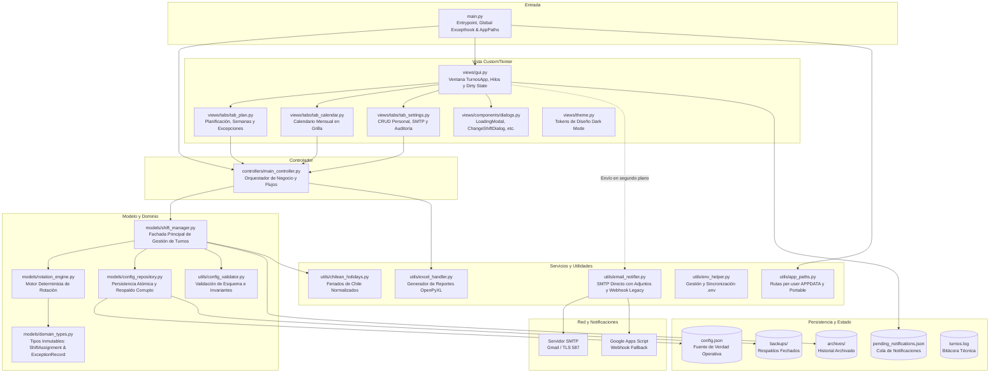
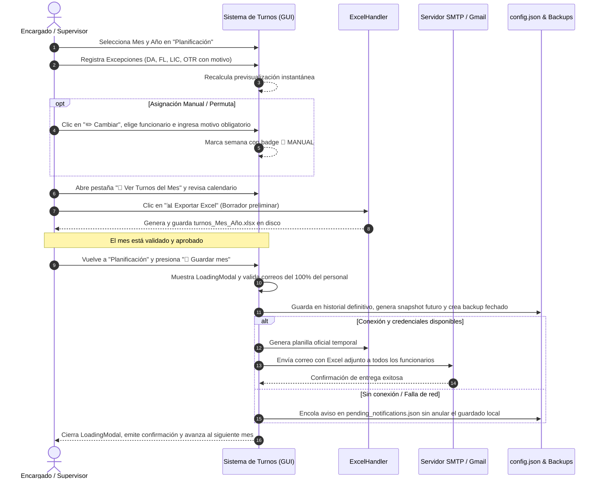

# 🗓️ Sistema de Gestión de Turnos de Guardia

<div align="center">


-16877D)
-217346?logo=microsoftexcel&logoColor=white)
%20%2B%20Apps%20Script-EA4335?logo=gmail&logoColor=white)


**Aplicación de escritorio moderna, robusta y automatizada para la planificación, asignación rotativa semanal, gestión de excepciones, exportación de reportes oficiales en Excel y notificación por correo de turnos de guardia.**

[Características](#-características-principales) •
[Manual de Usuario](#-manual-de-usuario) •
[Arquitectura](#-arquitectura-del-sistema) •
[Instalación y Uso](#-distribución-y-uso-rápido) •
[Notificaciones por Correo](#-sistema-de-notificaciones-por-correo-electrónico) •
[Flujo Operativo](#-flujo-de-trabajo-operativo-recomendado) •
[Pruebas](#-pruebas-automatizadas-testing) •
[Estructura](#-estructura-del-repositorio) •
[Documentación](#-documentación-oficial-del-proyecto)

</div>

---

## 📌 Descripción General

El **Sistema de Gestión de Turnos** es una solución informática de escritorio diseñada específicamente para resolver la complejidad operativa en la distribución de turnos de guardia semanales en equipos de funcionarios y personal técnico u operativo.

La confección manual o artesanal de calendarios en planillas dispersas suele acarrear errores frecuentes: funcionarios que repiten guardias consecutivas tras recuperar permisos, asignación injusta en festivos patrios o fechas de fin de año, pérdida del orden de rotación al cerrar meses fuera de secuencia y falta de comunicación oportuna al equipo cuando se autorizan cambios de última hora.

Este sistema resuelve de raíz dichos problemas integrando un **motor algorítmico determinista con reglas de equidad matemática**, una **interfaz gráfica ergonómica en modo oscuro**, un **generador de reportes oficiales en Excel (.xlsx)** y un **sistema dual de notificación por correo** (SMTP directo con informe adjunto y Webhook de Google Apps Script como respaldo serverless sin costo).

---

## ✨ Características Principales

### 🔄 1. Motor de Rotación Algorítmica Inteligente
- **Cola Circular Continua:** Asigna las semanas de guardia siguiendo estrictamente el orden secuencial del personal (`personal`, `siguiente_id`), garantizando equidad en la distribución del servicio.
- **Cola de Recuperación Prioritaria (`pendientes`):** Si un funcionario no puede cumplir su turno por encontrarse con permiso o licencia médica, se omite automáticamente y se añade a la lista de pendientes para recuperar su guardia en la primera semana en que vuelva a estar disponible.
- **Ventana de Enfriamiento y Descanso Mínimo (`min_gap_weeks = 4`):** El algoritmo impide que un funcionario reciba dos turnos en un intervalo menor a 4 semanas (incluso al recuperar turnos pendientes o tras asignaciones forzadas), evitando sobrecargas laborales y fatiga.
- **Protección Anual de Feriados Chilenos (`holidays.countries.chile`):** Evalúa el historial del año anterior para evitar que una persona repita la guardia en el mismo feriado nacional (Fiestas Patrias, Navidad, Año Nuevo, etc.) en años consecutivos. Compara los feriados por su nombre normalizado, adaptándose a días festivos móviles. Si no existe alternativa viable, asigna y emite una advertencia explícita visible en la interfaz y en los registros.
- **Previsualización Encadenada a Futuro:** Permite planificar y revisar meses futuros proyectando la rotación desde el último snapshot o estado conocido, sin alterar el frente de rotación ni el historial actual.
- **Asignaciones Manuales con Motivo Obligatorio (Permutas):** Permite forzar o reasignar la guardia de cualquier semana directamente desde la tarjeta semanal de la interfaz. Exige obligatoriamente el ingreso de un motivo justificativo para efectos de auditoría y notificación al equipo. Cuenta con reversión inmediata con un clic (`↺ Auto`).

### 🖥️ 2. Interfaz Gráfica Ergonómica (CustomTkinter Dark Mode)
- **Diseño de Alto Contraste:** Paleta de colores optimizada inspirada en entornos profesionales (`#111418`, `#1C2228`, `#57C7B5`), desarrollada sobre CustomTkinter.
- **Auto-Ajuste Inteligente a Pantallas Pequeñas:** Detección automática de resolución en notebooks o monitores compactos (≤ 1366×768), maximizando la ventana automáticamente (`state('zoomed')`) para garantizar máxima visibilidad de los controles.
- **Modal de Carga Animado (`LoadingModal`):** Cuadro de diálogo modal no bloqueante con barra de progreso indeterminada, títulos e íconos dinámicos (💾 -> 📊 -> 📧) que acompaña operaciones asíncronas (guardar mes, compilar planilla Excel y despachar correos), impidiendo clics accidentales duplicados.
- **Pestaña 📋 Planificación:**
  - Selector ágil de mes y año con previsualización en tiempo real.
  - **Tarjeta Dinámica de Turno:** Muestra el funcionario con guardia en curso (`● GUARDIA EN CURSO`) o la fecha y funcionario del próximo turno proyectado (`⏳ PRÓXIMO TURNO`), con avatar, iniciales y rango de fechas.
  - **Ingreso Flexible de Excepciones y Licencias por Rango de Fechas:** Admite fechas directas (`DD/MM/AAAA`) con campos 'Desde' y 'Hasta' y selector de mini-calendario emergente (📅), permitiendo registrar periodos continuos que cruzan meses (ej: 30 de octubre al 11 de noviembre), o días individuales y rangos rápidos. Cuenta con agrupación visual por rangos continuos en la lista, guardado automático persistente y filtros de visualización (Mes actual / Todas).
  - Validación estricta para excepciones tipo `OTR` (motivo obligatorio de al menos 3 caracteres).
  - **Tarjetas Semanales Interactivas:** Detalle de fechas, semana actual destacada (`● ACTUAL`), funcionario asignado, estado (`🤖 AUTOMÁTICO` o `📌 MANUAL`), diálogo modal de cambio (`ChangeShiftDialog`), visualización del motivo y desglose de saltados (`↷`).
  - Detección de cambios sucios en tiempo real mediante indicador visual en el título (`● Sistema de Turnos`) y botón `💾 Guardar mes ●`, con confirmación de seguridad al cerrar la aplicación (`WM_DELETE_WINDOW`).
- **Pestaña 📅 Ver Turnos del Mes (Calendario):**
  - Matriz visual mensual en cuadrícula con celdas coloreadas según el estado de cada día (Turno Regular, DA, FL, LIC, OTR, Fin de Semana y Día Actual).
  - Resumen dinámico superior con el conteo de excepciones del período.
  - Navegación temporal instantánea (`‹ Anterior`, `Siguiente ›` y botón `Hoy` con auto-desactivación inteligente si ya se visualiza el mes actual).
  - Título contextual adaptativo: *Historial*, *Calendario* o *Previsualización*.
  - Botón directo `📊 Exportar Excel` para generar el informe oficial en cualquier instante sin alterar la rotación.
- **Pestaña ⚙️ Ajustes:**
  - **Gestión Completa de Personal (CRUD):** Agregar funcionario con correo, editar nombre y correo, eliminar preservando turnos históricos y reordenar la posición en la rotación mediante botones `⬆` y `⬇`. Contador dinámico con badge de funcionarios activos y advertencias para personal sin correo registrado.
  - **Ajustes Avanzados Desplegables:** Panel tipo acordeón que resguarda configuraciones técnicas:
    - *Punto de inicio:* Selector para cambiar la persona inicial del ciclo con retroalimentación visual inmediata.
    - *Configuración SMTP Protegida:* Entradas de servidor, puerto, usuario y contraseña protegidas contra edición accidental con botón `✏️ Editar` / `❌ Cancelar`, botón `🔌 Probar Conexión` y casilla interactiva para enviar correos de prueba (`✉ Probar Envío`).
    - *Recuperación y Auditoría:* Creación de respaldos manuales, diálogo de restauración con nombres legibles (`📁 DD/MM/AAAA HH:MM — Guardar Mes AAAA`), respaldo preventivo obligatorio `pre_restore`, visor en tiempo real de la bitácora de auditoría (`auditoria[]`) y reintento manual de notificaciones pendientes con contador visual.
    - *Repositorio GitHub:* Acceso directo con botones para copiar el enlace al portapapeles o abrirlo en el navegador web.

### 📊 3. Generación Oficial de Reportes Excel (.xlsx)
- Construido en memoria con `openpyxl`, garantizando total independencia de plantillas externas.
- **Matriz Mensual Completa:** Cuadrícula de 31 días con nombres de funcionarios, números de día y letras de día de semana (`L, M, X, J, V, S, D`).
- **Diferenciación Visual Profesional:** Turno regular en rojo institucional (`#FF3B30`), cambios manuales / permutas en verde esmeralda (`#059669`), fines de semana en gris tenue (`#D9D9D9`) y días inválidos bloqueados (ej: 29-31 en febrero o 31 en meses de 30 días en gris oscuro con guion).
- **Trazabilidad de Permutas:** Cada celda con guardia manual incluye una nota interactiva (`Comment`) indicando el funcionario asignado, el original y el motivo justificado. Al pie se genera automáticamente la tabla formal `"REGISTRO DE CAMBIOS MANUALES DE GUARDIA (PERMUTAS / ACCIDENTES)"`.
- **Detalle de Excepciones OTR:** Genera la tabla oficial `"DETALLE DE PERMISOS Y EXCEPCIONES ESPECIALES (OTR)"` agrupando rangos de fechas consecutivos por funcionario y motivo justificado.
- **Columnas de Totales Acumulados (`AG:AK`):** Métricas automatizadas a la derecha de la cuadrícula con el conteo de `TURNOS`, `DA`, `FL`, `LIC` y `OTR`.
- **Bloque de Convenciones y Leyenda:** Muestras de color y descripciones formales de cada código al pie de la tabla.
- **Configuración de Impresión:** Orientación horizontal (Landscape Carta) ajustada automáticamente a 1 página de ancho (`fitToWidth = 1`).
- **Preservación Histórica:** Si un funcionario con turnos o permisos en el período fue dado de baja posteriormente del personal activo, el reporte lo incluye automáticamente para reflejar fielmente la realidad del servicio.

### 📧 4. Sistema Híbrido de Notificaciones por Correo Electrónico
- **Canal Principal (SMTP Directo con Adjunto):** Envía correos institucionales directamente a través de cualquier servidor SMTP (incluyendo Gmail con Contraseña de Aplicación) utilizando `smtplib` con cifrado TLS. Al guardar el mes aprobado, adjunta automáticamente el reporte oficial en Excel (`turnos_Mes_Año.xlsx`).
- **Canal de Respaldo Serverless (Google Apps Script):** Webhook HTTP POST (`scripts/google_apps_script.js`) desplegable en 3 minutos sin costos operativos, con soporte para redirecciones 302 de Google y plantillas HTML enriquecidas.
- **Cola Persistente de Salida (`NotificationQueue`):** Si el envío falla tras guardar el mes (por caída repentina de Internet o falla en el proveedor), el cierre local **nunca se anula**. El aviso queda retenido en `pending_notifications.json` y se reintenta automáticamente al reiniciar la app o bajo demanda desde la pestaña Ajustes.
- **Pre-validaciones de Seguridad:**
  1. Comprueba conexión activa a Internet vía TCP socket al puerto 443 antes de proceder.
  2. Valida que el 100% de los funcionarios activos tengan una dirección de correo válida registrada.
  3. Ejecuta todo el procesamiento en hilos en segundo plano (`threading.Thread`) para evitar congelamientos en la interfaz.

### 🛡️ 5. Resiliencia de Datos, Auditoría y Tolerancia a Fallos
- **Límites de Arquitectura y Dominio:**
  - `models/config_repository.py`: Aísla la persistencia atómica en disco y la validación estructural.
  - `models/rotation_engine.py`: Encapsula el cálculo puro de la rotación sin acoplamiento a la persistencia.
  - `models/domain_types.py`: Estructuras formales (`ShiftAssignment`, `ExceptionRecord`).
  - `utils/config_validator.py`: Validador estricto del esquema `schema_version = 2` y de invariantes de negocio.
- **Escritura Atómica en Disco:** Las modificaciones a `config.json` se escriben primero en un temporal (`config.json.tmp`), se sincronizan a disco con `os.fsync()` y se reemplazan atómicamente con `os.replace()`, blindando el estado contra cortes eléctricos o cierres forzados.
- **Respaldos Automáticos Fechados:** Antes de cada avance de mes o cambio crítico se genera una copia en `backups/` (`config_YYYYMMDD_HHMMSS_<tag>.json`), manteniendo una rotación automática de los últimos 20 respaldos.
- **Aislamiento de Archivos Corruptos:** Si `config.json` es alterado externamente con sintaxis corrupta, el sistema lo aísla en `backups/*.corrupted_<timestamp>` y restaura un estado base seguro sin interrumpir la operación.
- **Archivador de Historial Antiguo (`archive_old_records`):** Función de mantenimiento que archiva semanas y excepciones de más de 24 meses en `archives/`, conservando la regla de feriados anuales intacta y evitando el crecimiento desmedido de `config.json`.
- **Bitácora de Auditoría Interna (`auditoria`):** Registra marcas temporales, acciones (`CLOSE_MONTH`, `SET_MANUAL_ASSIGNMENT`, `RESTORE_BACKUP`, etc.) y parámetros operativos.
- **Logging Rotativo (`turnos.log`):** Logger con rotación de archivos (2 MB, 3 respaldos) para diagnóstico y trazabilidad técnica.

---

## 🏛️ Arquitectura del Sistema

El proyecto implementa una arquitectura **MVC (Modelo - Vista - Controlador)** desacoplada, orientada a dominio y reforzada con componentes de resiliencia:


```mermaid
flowchart TD
    subgraph Entrada
        MAIN[main.py\nEntrypoint, Global Excepthook & AppPaths]
    end

    subgraph Controlador
        CTRL[controllers/main_controller.py\nOrquestador de Negocio y Flujos]
    end

    subgraph Modelo y Dominio
        SM[models/shift_manager.py\nFachada Principal de Gestión de Turnos]
        RE[models/rotation_engine.py\nMotor Determinista de Rotación]
        CR[models/config_repository.py\nPersistencia Atómica y Respaldo Corrupto]
        DT[models/domain_types.py\nTipos Inmutables: ShiftAssignment & ExceptionRecord]
        VAL[utils/config_validator.py\nValidación de Esquema e Invariantes]
    end

    subgraph Persistencia y Estado
        CONF[(config.json\nFuente de Verdad Operativa)]
        BACKUPS[(backups/\nRespaldos Fechados)]
        ARCH[(archives/\nHistorial Archivado)]
        QUEUE[(pending_notifications.json\nCola de Notificaciones)]
        LOG[(turnos.log\nBitácora Técnica)]
    end

    subgraph Vista CustomTkinter
        GUI[views/gui.py\nVentana TurnosApp, Hilos y Dirty State]
        PLAN[views/tabs/tab_plan.py\nPlanificación, Semanas y Excepciones]
        CAL[views/tabs/tab_calendar.py\nCalendario Mensual en Grilla]
        SETT[views/tabs/tab_settings.py\nCRUD Personal, SMTP y Auditoría]
        MODAL[views/components/dialogs.py\nLoadingModal, ChangeShiftDialog, etc.]
        THEME[views/theme.py\nTokens de Diseño Dark Mode]
    end

    subgraph Servicios y Utilidades
        XL[utils/excel_handler.py\nGenerador de Reportes OpenPyXL]
        NOTIF[utils/email_notifier.py\nSMTP Directo con Adjuntos y Webhook Legacy]
        HOL[utils/chilean_holidays.py\nFeriados de Chile Normalizados]
        ENV[utils/env_helper.py\nGestión y Sincronización .env]
        PATHS[utils/app_paths.py\nRutas per-user APPDATA y Portable]
    end

    subgraph Red y Notificaciones
        SMTP_SRV[Servidor SMTP\nGmail / TLS 587]
        GAS_SRV[Google Apps Script\nWebhook Fallback]
    end

    MAIN --> CTRL
    MAIN --> GUI
    MAIN --> PATHS
    CTRL --> SM
    CTRL --> XL
    SM --> RE
    SM --> CR
    SM --> VAL
    RE --> DT
    CR --> CONF
    CR --> BACKUPS
    SM --> ARCH
    SM --> HOL
    GUI --> PLAN
    GUI --> CAL
    GUI --> SETT
    GUI --> MODAL
    PLAN --> CTRL
    CAL --> CTRL
    SETT --> CTRL
    GUI -.->|Envío en segundo plano| NOTIF
    GUI --> QUEUE
    NOTIF --> SMTP_SRV
    NOTIF --> GAS_SRV
```

### Componentes y Responsabilidades

| Módulo / Archivo | Responsabilidad |
|---|---|
| `main.py` | Punto de entrada. Resuelve directorio de datos per-user o portable (`app_paths`), carga `.env`, establece capturadores globales de excepciones (`sys.excepthook` y `report_callback_exception`) y levanta la GUI. |
| `controllers/main_controller.py` | Coordinador entre la vista y el modelo. Resuelve proyecciones temporales de meses futuros, consolida listas de personal activo e histórico para exportación y valida reglas previas al guardado. |
| `models/shift_manager.py` | Fachada principal del modelo: coordina el motor de rotación, almacenamiento de excepciones, permutas, snapshots mensuales, CRUD de personal y respaldos. |
| `models/rotation_engine.py` | Frontera de dominio para el algoritmo de generación determinista de turnos, reglas de enfriamiento (4 semanas) y restricciones de feriados. |
| `models/config_repository.py` | Gestión de persistencia atómica en `config.json`, escritura segura con `fsync`/`replace` y aislamiento de archivos corruptos. |
| `models/domain_types.py` | Dataclasses inmutables (`ShiftAssignment`, `ExceptionRecord`) que tipifican el dominio de turnos. |
| `views/gui.py` | Ventana principal `TurnosApp`. Controla pestañas, hilos en segundo plano, indicador de cambios sucios (`●`), cierre seguro y orquesta el flujo de guardado y notificación. |
| `views/tabs/tab_plan.py` | Pestaña de planificación: selector de período, formulario de excepciones (con motivo obligatorio para OTR), tarjetas semanales interactivas y tarjeta de próximo turno. |
| `views/tabs/tab_calendar.py` | Pestaña de calendario mensual: grilla de turnos, navegación rápida (`‹`, `›`, `Hoy`), leyendas de color y exportación a Excel. |
| `views/tabs/tab_settings.py` | Panel de ajustes: CRUD de personal con reordenamiento, configuración protegida de credenciales SMTP, pruebas de conexión y envío, restauración de respaldos y auditoría. |
| `views/components/dialogs.py` | Diálogos modales CustomTkinter: `LoadingModal` (carga animada), `ChangeShiftDialog` (permutas con motivo obligatorio), `PersonFormDialog`, `SelectPersonDialog`, `CustomConfirmDialog` y `PromptOTRMotiveDialog`. |
| `views/components/widgets.py` | Componentes visuales reutilizables: avatares con iniciales (`_avatar_ctk`), encabezados de sección (`_section_header`), nombres cortos y hover anti-parpadeo. |
| `views/theme.py` | Tokens de diseño, constantes de meses, días y diccionario de colores del modo oscuro (`P`). |
| `utils/excel_handler.py` | Motor de generación de reportes Excel `.xlsx` en memoria con fórmulas de resumen, comentarios interactivos, tablas de trazabilidad y formato de impresión apaisado. |
| `utils/email_notifier.py` | Despachador de correos mediante SMTP directo con soporte para adjuntos y webhook de Google Apps Script como respaldo. Validador de conexión a Internet y de formato de correo. |
| `utils/notification_queue.py` | Cola persistente de salida (`pending_notifications.json`) para reintentar notificaciones fallidas sin anular operaciones locales. |
| `utils/config_validator.py` | Validador del esquema JSON (`schema_version = 2`), garantizando integridad de IDs, nombres únicos, fechas y tipos de excepción. |
| `utils/app_paths.py` | Resolutor del directorio operativo: soporte automático para `%APPDATA%\Sistema de Turnos` y modo portable con `.portable` o `config.json` local. |
| `utils/chilean_holidays.py` | Integración con la librería `holidays` para Chile, con normalización fonética y caché LRU de días festivos. |
| `utils/env_helper.py` | Carga, lectura y actualización persistente de variables en el archivo local `.env`. |
| `utils/logger.py` | Configuración del sistema de logging con rotación automática de archivos (2 MB, 3 copias) hacia `turnos.log` y consola. |
| `scripts/google_apps_script.js` | Código fuente listo para desplegar en Google Apps Script como webhook serverless alternativo. |
| `reset_historial.py` | Script auxiliar para restablecer el historial y volver a las asignaciones de inicio de manera controlada. |

---

## 🏷️ Convenciones de Excepciones y Personal

### Tipos de Excepción Admitidos

| Sigla | Nombre | Color Visual | Descripción y Regla Operativa |
|:---:|---|:---:|---|
| **`DA`** | Día Administrativo | Naranja (`#B45309`) | Permiso administrativo legalmente concedido. Salta el turno y agrega al funcionario a pendientes. |
| **`FL`** | Feriado Legal | Violeta (`#5B21B6`) | Período reglamentario de vacaciones. Salta el turno y agrega a pendientes. |
| **`LIC`** | Licencia Médica | Turquesa (`#0E7490`) | Reposo por prescripción de salud. Salta el turno y agrega a pendientes. |
| **`OTR`** | Otro Permiso Especial | Gris Azulado (`#374151`) | Comisión de servicio, duelo, capacitación, etc. **Exige obligatoriamente motivo justificativo (mín. 3 caracteres)**, exportado a Excel en celda y tabla especial. |
| **`FOR`** | Asignación Manual / Permuta | Verde Esmeralda (`#059669`) | Reemplazo directo en la semana. Se gestiona desde el botón `✏️ Cambiar` de la tarjeta semanal y exige motivo obligatorio. |

### Convención de Registro de Personal
Los nombres del personal se registran conforme al formato institucional estándar:
```text
APELLIDO NOMBRE   o   NOMBRE APELLIDO
```
El sistema normaliza espacios, previene nombres duplicados, genera automáticamente las iniciales de 2 letras para los avatares gráficos e incluye el campo opcional de correo electrónico para notificaciones.

---

## 🚀 Distribución y Uso Rápido

### Modo 1: Ejecutable Standalone Autónomo (`Sistema de Turnos.exe`) — Recomendado

Diseñado específicamente para computadores de funcionarios y estaciones de trabajo en **Windows 10 y Windows 11**. **No requiere permisos de administrador ni asistente de instalación**.

1. **Cero Instalación y Sin Privilegios:** No requiere solicitar claves de administrador al departamento de TI ni lidiar con bloqueos de políticas de seguridad (UAC).
2. **Uso Inmediato:** Copia `dist/Sistema de Turnos.exe` a tu Escritorio, carpeta personal o unidad USB y haz doble clic para iniciar.
3. **Persistencia Automática en Perfil de Usuario:**
   Los archivos de estado (`config.json`), respaldos (`backups/`), historial archivado (`archives/`), cola de avisos y registros técnicos se gestionan automáticamente en:
   ```text
   %APPDATA%\Sistema de Turnos\
   ```
4. **Soporte para Modo Portable:**
   Si colocas un archivo `.portable` o un archivo `config.json` en la misma carpeta donde reside `Sistema de Turnos.exe`, el sistema operará automáticamente de forma local junto al ejecutable (ideal para pendrives).
5. **Actualizaciones sin Pérdida de Datos:**
   Para actualizar a una versión nueva, simplemente reemplaza el archivo `Sistema de Turnos.exe`. El historial, personal, excepciones y respaldos se conservan íntegramente.

---

### Modo 2: Desarrollador (Ejecución desde Código Fuente)

#### Requisitos Previos:
- Python 3.10 o superior (compatible y probado hasta Python 3.14).
- PowerShell o Símbolo del Sistema en Windows.

#### Paso a paso:

1. **Clonar el repositorio:**
   ```powershell
   git clone https://github.com/MartinLopez1011/Sistema-de-turnos.git
   cd "Sistema de turnos"
   ```

2. **Crear y activar el entorno virtual:**
   ```powershell
   py -m venv .venv
   .\.venv\Scripts\Activate.ps1
   ```

3. **Instalar dependencias:**
   ```powershell
   # Dependencias de producción
   pip install -r requirements.txt

   # Dependencias de desarrollo y testing (opcional)
   pip install -r requirements-dev.txt
   ```

4. **Inicializar plantillas de configuración seguras:**
   ```powershell
   Copy-Item .env.example .env
   Copy-Item config.example.json config.json
   ```

5. **Iniciar la aplicación:**
   ```powershell
   python main.py
   ```

---

## 📖 Manual de Usuario

### 1. Iniciar la Planificación Mensual
1. Inicia la aplicación.
2. En la pestaña **📋 Planificación**, selecciona el **mes** y **año** a coordinar.
3. Observa la tarjeta superior: indicará el funcionario actualmente de guardia (`● GUARDIA EN CURSO`) o el próximo proyectado (`⏳ PRÓXIMO TURNO`).
4. Revisa las tarjetas semanales calculadas automáticamente por el algoritmo según la rotación continua, pendientes y descanso mínimo de 4 semanas.

### 2. Registrar Excepciones (Permisos, Vacaciones, Licencias)
Cuando un funcionario no esté disponible en determinadas fechas:
1. Selecciona el funcionario en el menú desplegable del panel lateral.
2. Ingresa los días correspondientes en el campo de texto. Puedes especificar días individuales o rangos (ej: `1-5, 12, 20-25`).
3. Elige el tipo de excepción:
   - **DA:** Día Administrativo.
   - **FL:** Feriado Legal.
   - **LIC:** Licencia Médica.
   - **OTR:** Otro Permiso Especial. Al marcar esta opción se desplegará obligatoriamente el campo **Motivo / Justificación** (mínimo 3 caracteres).
4. Presiona **＋ Añadir**.
5. Las tarjetas semanales se recalcularán de inmediato. Si el funcionario tenía asignada una semana en esas fechas, el sistema lo saltará, lo añadirá a la cola de pendientes y asignará al siguiente funcionario disponible.
6. El título de la ventana y el botón de guardado mostrarán el indicador sucio (`●`).

### 3. Gestionar Asignaciones Manuales (Permutas de Guardia)
Para cambiar el funcionario asignado a una semana específica:
1. En la tarjeta de la semana deseada, presiona el botón **✏️ Cambiar**.
2. En el cuadro de diálogo modal `ChangeShiftDialog`, selecciona el nuevo funcionario asignado.
3. Escribe el **motivo obligatorio del cambio** (ej: *"Permuta acordada por motivos familiares"*).
4. Presiona **Aceptar y Registrar**.
5. La tarjeta semanal quedará identificada con el badge verde **📌 MANUAL** y el motivo registrado.
6. Si requieres deshacer el cambio y volver al cálculo algorítmico, presiona el botón **↺ Auto**.

### 4. Revisar la Cuadrícula en el Calendario
1. Abre la pestaña **📅 Ver Turnos del Mes** o haz clic en el botón superior **📅 Abrir calendario**.
2. Verifica visualmente la distribución de guardias (rojo), cambios manuales (verde esmeralda), excepciones y fines de semana.
3. Puedes navegar rápidamente con los botones `‹ Anterior`, `Siguiente ›` o volver instantáneamente al mes actual con `Hoy`.

### 5. Exportar el Reporte Oficial a Excel
1. Desde la pestaña **📅 Ver Turnos del Mes**, presiona el botón verde **📊 Exportar Excel**.
2. Selecciona la carpeta y nombre del archivo destino (`turnos_<Mes>_<Año>.xlsx`).
3. Abre el archivo en Microsoft Excel para revisar la matriz mensual, totales por funcionario, comentarios en celdas, tabla de permutas y tabla de permisos especiales.

> [!NOTE]
> **Exportar Excel es una operación de solo lectura.** No altera el historial ni avanza la rotación, permitiendo emitir borradores preliminares las veces que sea necesario.

### 6. Guardar y Cerrar el Mes Definitivamente
Cuando la planificación esté aprobada y revisada:
1. Regresa a la pestaña **📋 Planificación**.
2. Presiona el botón verde **💾 Guardar mes**.
3. El sistema verificará que todas las semanas tengan funcionario asignado, que exista conexión a Internet si hay avisos que despachar y que todos los funcionarios tengan correo válido.
4. Confirma la operación en el diálogo de verificación.
5. El diálogo animado `LoadingModal` guiará el proceso en segundo plano:
   - Guarda las semanas en el `historial` definitivo.
   - Crea un snapshot del estado para el mes siguiente.
   - Avanza la cola de rotación global.
   - Crea un respaldo automático fechado (`pre_advance`).
   - Genera la planilla Excel oficial y la despacha por correo electrónico a todo el personal (vía SMTP con adjunto o Webhook).
6. Al concluir, el selector avanzará automáticamente al siguiente mes.

### 7. Administrar Personal y Credenciales en Ajustes
En la pestaña **⚙️ Ajustes**:
- **Gestión de Personal:** Añade nuevos funcionarios con su correo, edita sus datos o elimínalos (conservando siempre sus turnos históricos pasados). Usa `⬆` y `⬇` para ajustar el orden de rotación.
- **Ajustes Avanzados (Desplegable):**
  - Modifica la persona inicial de la rotación para nuevos ciclos sin historial.
  - Configura el servidor SMTP: haz clic en `✏️ Editar`, ingresa los datos, pulsa `💾 Guardar` y valida el servicio con `🔌 Probar Conexión` y `✉ Probar Envío`.
  - Crea respaldos manuales o restaura versiones anteriores.
  - Consulta la bitácora de auditoría interna y reintenta envíos pendientes.

---

## 📧 Sistema de Notificaciones por Correo Electrónico

El sistema dispone de dos mecanismos complementarios para el envío de notificaciones:

### Opción A: SMTP Directo con Archivo Excel Adjunto (Recomendada)
Permite enviar correos institucionales directamente desde la aplicación de escritorio a través de cualquier servidor SMTP (incluyendo Gmail, Outlook o servidores institucionales), adjuntando la planilla Excel oficial al guardar el mes.

#### Configuración con Gmail (3 minutos):
1. Ingresa a tu [Cuenta de Google](https://myaccount.google.com/) y asegúrate de tener activada la **Verificación en 2 pasos**.
2. Ve a [Contraseñas de Aplicación](https://myaccount.google.com/apppasswords).
3. Escribe un nombre descriptivo (ej: *Sistema de Turnos*) y genera la clave de 16 caracteres.
4. En el Sistema de Turnos, ve a **⚙️ Ajustes > Ajustes Avanzados > Notificaciones por Correo (SMTP)**:
   - Pulsa **✏️ Editar**.
   - **Host SMTP:** `smtp.gmail.com`
   - **Puerto:** `587`
   - **Usuario:** `tu_correo@gmail.com`
   - **Contraseña:** Pega la contraseña de aplicación de 16 caracteres.
   - Pulsa **💾 Guardar**.
5. Prueba la configuración con **🔌 Probar Conexión** y envía un mensaje de prueba con **✉ Probar Envío**.

> [!TIP]
> Los datos SMTP se almacenan localmente en el archivo `.env` bajo permisos de usuario y nunca se comparten ni suben a repositorios remotos.

---

### Opción B: Webhook Serverless (Google Apps Script — Respaldo Alternativo)
Si prefieres no utilizar credenciales SMTP locales, puedes utilizar Google Apps Script como pasarela HTTP POST serverless gratuita:

1. Ingresa a [Google Apps Script](https://script.google.com/) con tu cuenta de Google.
2. Crea un **Nuevo proyecto** llamado `Webhook Sistema Turnos`.
3. Abre [`scripts/google_apps_script.js`](./scripts/google_apps_script.js) de este repositorio, copia su código y reemplaza el contenido en el editor de Apps Script.
4. Haz clic en **Implementar > Nueva implementación**:
   - Tipo: **Aplicación web**.
   - Ejecutar como: **Yo**.
   - Quién tiene acceso: **Cualquier persona**.
5. Concede los permisos y copia la URL terminada en `/exec`.
6. En tu archivo `.env` local, asigna la variable `WEBHOOK_URL=<tu_url>`.

---

## 📋 Flujo de Trabajo Operativo Recomendado


```mermaid
sequenceDiagram
    autonumber
    actor Sup as Encargado / Supervisor
    participant UI as Sistema de Turnos (GUI)
    participant XL as ExcelHandler
    participant SMTP as Servidor SMTP / Gmail
    participant DB as config.json & Backups

    Sup->>UI: Selecciona Mes y Año en "Planificación"
    Sup->>UI: Registra Excepciones (DA, FL, LIC, OTR con motivo)
    UI-->>UI: Recalcula previsualización instantánea
    opt Asignación Manual / Permuta
        Sup->>UI: Clic en "✏️ Cambiar", elige funcionario e ingresa motivo obligatorio
        UI-->>UI: Marca semana con badge 📌 MANUAL
    end
    Sup->>UI: Abre pestaña "📅 Ver Turnos del Mes" y revisa calendario
    Sup->>XL: Clic en "📊 Exportar Excel" (Borrador preliminar)
    XL-->>Sup: Genera y guarda turnos_Mes_Año.xlsx en disco
    Note over Sup,UI: El mes está validado y aprobado
    Sup->>UI: Vuelve a "Planificación" y presiona "💾 Guardar mes"
    UI->>UI: Muestra LoadingModal y valida correos del 100% del personal
    UI->>DB: Guarda en historial definitivo, genera snapshot futuro y crea backup fechado
    alt Conexión y credenciales disponibles
        UI->>XL: Genera planilla oficial temporal
        UI->>SMTP: Envía correo con Excel adjunto a todos los funcionarios
        SMTP-->>UI: Confirmación de entrega exitosa
    else Sin conexión / Falla de red
        UI->>DB: Encola aviso en pending_notifications.json sin anular el guardado local
    end
    UI-->>Sup: Cierra LoadingModal, emite confirmación y avanza al siguiente mes
```

---

## 🛠️ Compilación a Ejecutable Standalone (.exe)

Para compilar la aplicación en un archivo `.exe` único independiente con todos los recursos e íconos empaquetados:

```powershell
.\.venv\Scripts\python.exe -m PyInstaller "Sistema de Turnos.spec"
```

El ejecutable resultante se generará en la carpeta `dist/Sistema de Turnos.exe`.

### Especificaciones Técnicas del Archivo `.spec`:
- **Modo:** Un solo archivo independiente (`onefile`).
- **Modo Consola:** Desactivado (`console=False`), ejecución silenciosa nativa de Windows.
- **Recursos Integrados:** Carpeta `assets/` (íconos de aplicación `.ico` y `.png`) y plantilla `config.json`.
- **Módulos Ocultos Recolectados:** `holidays.countries.chile`, `customtkinter` y dependencias de estilos.

---

## 🧪 Pruebas Automatizadas (Testing)

El repositorio cuenta con una batería de **132 pruebas unitarias y de integración** automatizadas construidas con `pytest` y `pytest-mock`:

- Algoritmo de rotación determinista, ciclo continuo y equidad distributiva.
- Cola de pendientes y regla de enfriamiento de descanso (`effective_gap = 4` semanas).
- Restricciones anuales de feriados nacionales chilenos y alertas por falta de alternativas.
- Permutas manuales, justificaciones obligatorias y reversión rápida (`↺ Auto`).
- Excepciones justificadas (DA, FL, LIC, OTR) y validación de motivos mínimos en OTR.
- Resiliencia de datos, escritura atómica, validación de esquema y recuperación de archivos corruptos.
- Paridad en exportación a Excel (.xlsx), comentarios interactivos y tablas oficiales de permutas y OTR.
- Clientes de notificación SMTP y Webhook, cola de reintentos (`pending_notifications.json`) y manejo de errores.
- CRUD de funcionarios, reordenamiento de rotación (`⬆`/`⬇`) y preservación de historial de ex-funcionarios.
- Interfaz gráfica, bloqueo de edición SMTP, prevención de salida accidental (`WM_DELETE_WINDOW`) y modal animado.

Para ejecutar la suite de pruebas:

```powershell
.\.venv\Scripts\python.exe -m pytest -v
```

Resultado verificado:
```text
============================= 132 passed in ~2.35s =============================
```

---

## 📁 Estructura del Repositorio

```text
Sistema de turnos/
├── assets/                          # Recursos gráficos (íconos PNG e ICO de la app)
│   ├── app_icon.ico
│   ├── app_icon.png
│   ├── error.png
│   ├── save.png
│   └── success.png
├── backups/                         # Copias de seguridad automáticas fechadas de config.json
├── controllers/                     # Capa de Control (MVC)
│   └── main_controller.py          # Orquestador entre GUI, ShiftManager y ExcelHandler
├── models/                          # Capa de Modelo y Dominio (MVC)
│   ├── config_repository.py         # Persistencia atómica, fsync y aislamiento de archivos corruptos
│   ├── domain_types.py              # Tipos inmutables (ShiftAssignment, ExceptionRecord)
│   ├── rotation_engine.py           # Frontera de dominio del algoritmo de rotación
│   └── shift_manager.py             # Fachada principal de lógica de negocio, colas y snapshots
├── views/                           # Capa de Presentación (MVC)
│   ├── components/                  # Componentes reutilizables y modales
│   │   ├── dialogs.py               # LoadingModal, ChangeShiftDialog, PersonFormDialog, etc.
│   │   └── widgets.py               # Avatares, iniciales, encabezados y hover anti-parpadeo
│   ├── tabs/                        # Módulos de pestañas de la interfaz
│   │   ├── tab_calendar.py          # Pestaña "Ver Turnos del Mes" (Calendario visual en grilla)
│   │   ├── tab_plan.py              # Pestaña "Planificación" (Semanas, excepciones y turnos)
│   │   └── tab_settings.py          # Pestaña "Ajustes" (CRUD Personal, SMTP, Backups, Auditoría)
│   ├── gui.py                       # Ventana principal TurnosApp, hilos y control de estado
│   └── theme.py                     # Tokens de diseño, paleta Dark Mode y constantes
├── utils/                           # Utilidades y Servicios Auxiliares
│   ├── app_paths.py                 # Resolutor de rutas (%APPDATA% per-user y modo Portable)
│   ├── chilean_holidays.py          # Feriados nacionales de Chile normalizados
│   ├── config_validator.py          # Validador de esquema JSON (schema_version = 2)
│   ├── email_notifier.py            # Despachador de correos SMTP (con adjuntos) y Webhook fallback
│   ├── env_helper.py                # Carga y actualización persistente del archivo .env
│   ├── excel_handler.py             # Motor de generación de reportes Excel openpyxl
│   ├── logger.py                    # Sistema de logging rotativo (turnos.log y consola)
│   └── notification_queue.py        # Cola duradera de notificaciones pendientes
├── scripts/                         # Scripts de backend y soporte
│   └── google_apps_script.js        # Código Webhook serverless para Google Apps Script
├── tests/                           # Suite de 132 pruebas automatizadas con pytest
│   ├── conftest.py
│   ├── test_app_paths.py
│   ├── test_controller_export_parity.py
│   ├── test_email_notification_feature.py
│   ├── test_email_notifier.py
│   ├── test_env_helper.py
│   ├── test_excel_handler.py
│   ├── test_excel_historical_and_styling.py
│   ├── test_future_preview.py
│   ├── test_improvements.py
│   ├── test_loading_modal.py
│   ├── test_logger.py
│   ├── test_manual_assignments.py
│   ├── test_manual_assignments_edge_cases.py
│   ├── test_manual_assignments_excel.py
│   ├── test_otr_motive.py
│   ├── test_phase2_boundaries.py
│   ├── test_qa_flows_and_edge_cases.py
│   ├── test_reliability_features.py
│   ├── test_reset_historial.py
│   ├── test_settings_smtp_lock.py
│   ├── test_shift_manager.py
│   ├── test_shift_manager_backup_and_reset.py
│   ├── test_shift_manager_crud.py
│   ├── test_shift_manager_resilience.py
│   ├── test_shift_manager_rotation.py
│   └── test_tab_plan_ranges.py
├── .env.example                     # Plantilla de variables de entorno (SMTP y Webhook)
├── app_version.py                   # Constantes de versión de la aplicación y esquema
├── config.example.json              # Plantilla sanitizada de configuración base
├── reset_historial.py               # Script para reiniciar historial conservando datos de inicio
├── requirements.txt                 # Dependencias Python de producción
├── requirements-dev.txt             # Dependencias para desarrollo y pruebas
├── Sistema de Turnos.spec           # Archivo de especificación para empaquetado con PyInstaller
├── SECURITY.md                      # Directiva de seguridad del repositorio
├── POLITICAS_Y_SEGURIDAD.md         # Manual formal de políticas de privacidad y soberanía de datos
└── README.md                        # Documentación principal del sistema
```

---

## 💾 Persistencia, Auditoría y Ubicación de Datos

En la versión compilada (`Sistema de Turnos.exe`), la carpeta de trabajo del usuario es:

```text
%APPDATA%\Sistema de Turnos\
├── config.json                  # Estado actual y fuente de verdad operativa
├── backups\                     # Respaldos fechados automáticos y preventivos
├── archives\                    # Semanas y excepciones históricas archivadas (> 24 meses)
├── pending_notifications.json   # Cola de notificaciones retenidas por falta de conectividad
└── turnos.log                   # Registro técnico rotativo de operaciones
```

*Nota:* Si se detecta un archivo `.portable` o `config.json` junto al archivo `.exe`, el sistema opera automáticamente en **Modo Portable** dentro de esa misma carpeta.

---

## 📚 Documentación Oficial del Proyecto

Encuentra los manuales y documentos técnicos generados en la raíz del proyecto:

- 📄 **[Manual de Usuario Oficial (PDF)](./Manual_de_Usuario_Sistema_de_Turnos.pdf):** Manual interactivo a todo color con capturas de pantalla, instrucciones de uso y guía paso a paso para funcionarios y supervisores.
- 📝 **[Requerimientos y Alcance del Sistema (Word)](./Requerimientos_del_Sistema_Turnos.docx):** Especificación funcional formal con 17 requerimientos funcionales (RF), 7 requerimientos no funcionales (RNF), reglas de negocio y ficha de conformidad institucional.
- 📊 **[Documento Ejecutivo y Resumen del Proyecto (Word)](./Sistema_de_Gestion_de_Turnos.docx):** Informe ejecutivo con diagramas editables, análisis de retorno operativo, arquitectura MVC y resumen integral.
- 🛡️ **[Políticas de Seguridad y Privacidad (Markdown)](./POLITICAS_Y_SEGURIDAD.md) y [versión Word](./Politicas_y_Seguridad_del_Sistema.docx):** Manual formal de cumplimiento normativo (Ley N° 19.628 y Ley N° 21.663), privacidad de datos personales (PII), arquitectura local y certificación de confidencialidad.
- 🔒 **[Directiva de Seguridad del Repositorio (Markdown)](./SECURITY.md):** Pautas para exclusión de datos sensibles, manejo de secretos y reporte de incidentes.

---

## 📄 Licencia y Créditos

Desarrollado para optimizar la gestión operativa y garantizar la máxima equidad y transparencia en la asignación de turnos de guardia institucional.  
Código abierto bajo los términos establecidos en la organización institucional.
